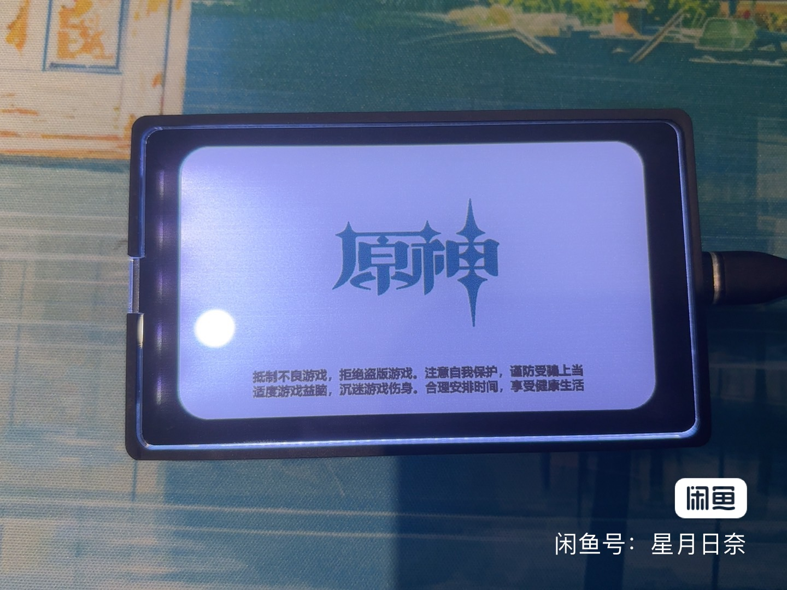
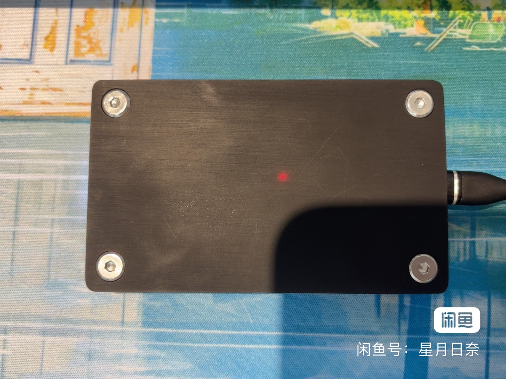
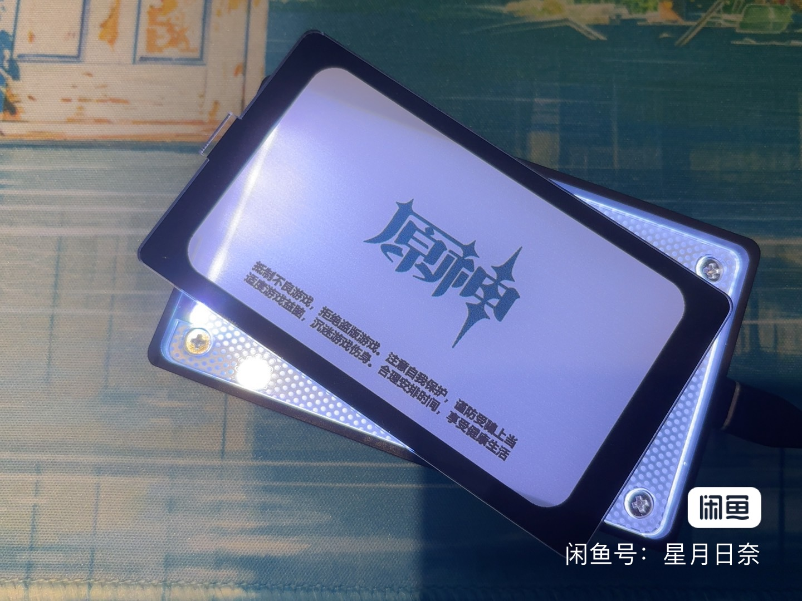

# Akari Pro
使用 RP2040 + PN532 制作的适用于SEGA/KONAMI Aime 兼容读卡器，KairoTech闲鱼出售商品（现已经被Akari II替代）  

##由于剩余大量物料，加群645758744可以付邮送一些~

- 支持卡片类型: [FeliCa](https://zh.wikipedia.org/wiki/FeliCa)（Amusement IC、Suica、八达通等）和 [MIFARE](https://zh.wikipedia.org/wiki/MIFARE)（Aime，Banapassport）
- 固件基于Mahuyo大佬的[Arduino-Aime-Reader](https://github.com/Sucareto/Arduino-Aime-Reader/blob/main/README.md)，十分感谢大佬Orz

固件相关信息和使用方法请查看Mahuyo大佬的[Arduino-Aime-Reader](https://github.com/Sucareto/Arduino-Aime-Reader/blob/main/README.md)，本项目仅修改了引脚定义以及适配RP2040

- 如果读卡器没有正常工作且游戏有使用 amdaemon 的，可以参考 config_common.json 内 aime > unit > port 确认端口号

### 使用教程
1. 焊接好PCB（废话）
2. 按下PCB上的BOOT按键接入USB线缆，刷入本repo内固件
3. 测试完成后将PCB放入3D外壳并装好螺丝
4. 定位好磁铁后使用胶水将磁铁粘在顶板上（需要注意的是，部分胶水会对UV印刷层产生影响，我们使用的是百得的胶水）
5. 等待胶水硬化之后就可以测试一下能否正常安装，磁铁的定位请十分注意
6. 大功告成~

### 物料清单
- PCB元件: 在Repo的PCB文件夹内，但需要注意RP2040很挑Flash，淘宝里不到1RMB的基本无法使用，推荐买正规的Flash
- PCB制造 & 3D打印: 推荐嘉立创，3D请注意使用光固化
- 亚克力面板: 淘宝随便找，一般差距不会太大，使用UV印刷
- 螺母: 淘宝固万基旗舰店的[镀镍十字扁平头螺丝](https://m.tb.cn/h.g1rzLvyOX09U4BH?tk=sZ6CWHJcB1r)（自行购买请一定注意能否被磁铁吸住）
- 螺丝: 淘宝固万基旗舰店的[内六角夹板螺母](https://m.tb.cn/h.g1apAKJ12Nif9Q6?tk=VZhZWHJ1jPt MF7997)
- 磁铁: 淘宝鑫涌泉磁业[小圆形磁铁](https://m.tb.cn/h.gYnSHoJE2Vr6VK5?tk=gqvIWHJ1VeJ)

### 图片

### 引用库：
- 固件: [Arduino-Aime-Reader](https://github.com/Sucareto/Arduino-Aime-Reader/blob/main/README.md)
- 驱动 WS2812B: [FastLED](https://github.com/FastLED/FastLED)
- 驱动 PN532: [PN532](https://github.com/elechouse/PN532) 或 [Aime_Reader_PN532](https://github.com/Sucareto/Aime_Reader_PN532)
- 读取 FeliCa 参考: [PN532を使ってArduinoでFeliCa学生証を読む方法](https://qiita.com/gpioblink/items/91597a5275862f7ffb3c)
- 读取 FeliCa 数据的程序: [NFC TagInfo](https://play.google.com/store/apps/details?id=at.mroland.android.apps.nfctaginfo)，[NFC TagInfo by NXP](https://play.google.com/store/apps/details?id=com.nxp.taginfolite)
- MIFARE 读写卡，数据分析: [MifareClassicTool](https://github.com/ikarus23/MifareClassicTool)，[MifareOneTool](https://github.com/xcicode/MifareOneTool)
